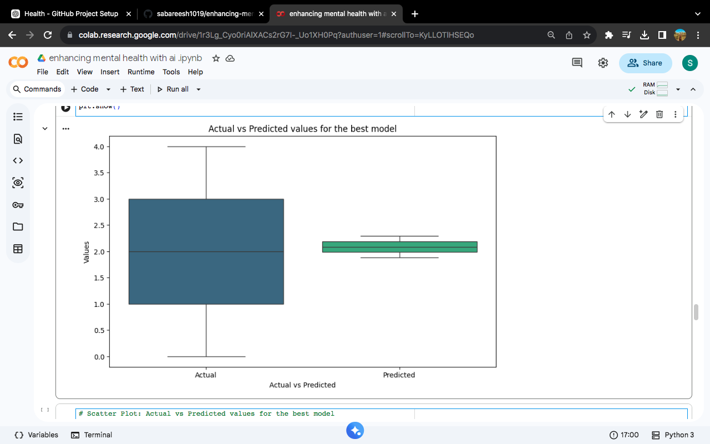

->Enhancing Mental Health with AI 🧠🤖

-> 📌 Project Overview

**Enhancing Mental Health with AI** is a machine learning and natural language processing project designed to analyze emotional states from text and provide suitable therapy suggestions.

The project combines **machine learning-based prediction**, **sentiment analysis**, and **emotion detection** to explore how AI can be used as a supportive tool for mental-health-related applications.

> ⚠️ **Disclaimer:** This project is developed for educational and research purposes only. It is not a medical diagnostic system and should not replace professional mental health care.

---

-> 🎯 Objectives

* Analyze emotional and sentiment information from user input.
* Preprocess and transform mental-health-related data for machine learning.
* Select relevant features using Mutual Information.
* Compare multiple machine learning regression models.
* Identify the model with the lowest Mean Squared Error (MSE).
* Detect emotions from text using a transformer-based model.
* Provide therapy suggestions based on detected emotional categories.

---

-> 🗂️ Project Workflow

```text
Input Dataset
     ↓
Data Preprocessing
     ↓
Missing Value Removal
     ↓
Duplicate Removal
     ↓
Label Encoding
     ↓
Feature Scaling
     ↓
Feature Selection
     ↓
Train/Test Split
     ↓
Machine Learning Models
     ↓
Model Evaluation using MSE
     ↓
Best Model Selection
     ↓
Emotion & Sentiment Analysis
     ↓
Therapy Recommendation
```

---

->📊 Data Preprocessing

The notebook performs several preprocessing steps:

* Converts the `timestamp` column into datetime format.
* Removes missing values.
* Removes duplicate records.
* Encodes categorical variables using `LabelEncoder`.
* Applies scaling to numerical variables.
* Removes non-numeric/text columns when required for machine learning.
* Uses feature selection to identify the most informative features.

---

->🔍 Feature Selection

The project uses:

**Mutual Information + SelectKBest**

to select the top **2 features** for the machine learning model.

The target variable used for prediction is:

```text
therapy_type
```

---

->🤖 Machine Learning Models

Five regression models are trained and compared:

1. **Linear Regression**
2. **Decision Tree Regressor**
3. **Random Forest Regressor**
4. **Gradient Boosting Regressor**
5. **Support Vector Regressor (SVR)**

The dataset is divided into training and testing sets using an **80/20 split**.

-> Evaluation Metric

The models are evaluated using:

**Mean Squared Error (MSE)**

The model with the **lowest MSE** is selected as the best-performing model.

---

->📈 Model Evaluation & Visualization

The project generates visualizations to examine model performance, including:

* Actual vs Predicted values
* Scatter plot of actual and predicted values
* Residual distribution
* Box plot comparing actual and predicted values
These visualizations help understand the prediction behavior of the selected model.
---

-> 💬 Sentiment & Emotion Analysis

The project also analyzes free-text user input using multiple NLP techniques.

-> TextBlob

TextBlob is used for sentiment analysis and provides a polarity score.

-> VADER

VADER is used to calculate a compound sentiment score ranging from negative to positive sentiment.

-> DistilBERT

A pretrained transformer model:

```text
bhadresh-savani/distilbert-base-uncased-emotion
```

is used to identify the emotion expressed in the user's text.

---

-> 🧠 Therapy Recommendation

Based on the detected emotion, the project provides a corresponding supportive recommendation.

Examples include:

| Detected Emotion | Suggested Support                  |
| ---------------- | ---------------------------------- |
| Anger            | Cognitive Behavioral Therapy (CBT) |
| Depression       | Counseling                         |
| Anxiety          | Mindfulness Therapy                |
| Joy              | Self-Care                          |
| Love             | Social Support                     |
| Surprise         | ACT Therapy                        |
| Loneliness       | Counseling                         |

If an emotion does not match the predefined categories, the system provides a general recommendation to discuss feelings with a professional.

---

->🛠️ Technologies Used

-> Programming Language

* Python

->Data Science & Machine Learning

* Pandas
* NumPy
* Scikit-learn

-> Visualization

* Matplotlib
* Seaborn

-> Natural Language Processing

* TextBlob
* NLTK
* VADER Sentiment

-> Deep Learning / Transformers

* Hugging Face Transformers
* DistilBERT

->Development Environment

* Google Colab
* Jupyter Notebook

---

-> 📚 Libraries

The project uses libraries including:

```text
pandas
numpy
scikit-learn
matplotlib
seaborn
nltk
textblob
vaderSentiment
transformers
```

---
-> ▶️ How to Run

-> 1. Clone the repository

```bash
git clone https://github.com/YOUR_USERNAME/enhancing-mental-health-with-ai.git
```
-> 2. Open the notebook
Open:
```text
enhancing mental health with ai.ipynb
```
using Google Colab or Jupyter Notebook.

-> 3. Add the dataset

The notebook currently expects the dataset at:
```text
/content/sabari'dataset(in).csv
```
When running outside Google Colab, update the dataset path accordingly.

-> 4. Install required packages

```bash
pip install pandas numpy scikit-learn matplotlib seaborn nltk textblob vaderSentiment transformers
```

-> 5. Run the notebook

Execute the cells sequentially.
The final section allows the user to enter a description of their current emotions:
```text
Describe your current emotions:
```
The system then produces:

* Sentiment result
* Detected emotion
* Suggested therapy/support
---
->💡 Example

```text
User Input:
I have been feeling very angry and frustrated lately.
↓
Sentiment Analysis
↓
Emotion Detection
↓
Therapy Recommendation
Cognitive Behavioral Therapy (CBT)
```
---

-> 📁 Project Structure
```text
enhancing-mental-health-with-ai/
│
├── enhancing mental health with ai.ipynb
├── sabari'dataset(in).csv
├── README.md
└── LICENSE
```
---
->Results

-> Actual vs Predicted Values

The following visualization compares the actual therapy type values with the values predicted by the best-performing machine learning model.


-> 🚀 Future Improvement
Possible future improvements include:
* Developing a web interface for the application.
* Adding more diverse mental-health datasets.
* Improving emotion classification accuracy.
* Using classification models specifically for therapy-category prediction.
* Adding model performance metrics such as MAE and R².
* Improving the mapping between detected emotions and recommendations.
* Adding stronger safety mechanisms for high-risk mental-health situations.
* Deploying the application as a web-based AI assistant.
---
-> ⚠️ Disclaimer
This project is intended for **educational and research purposes only**.
The recommendations generated by this system are not medical advice, diagnosis, or treatment. Users experiencing serious mental-health concerns should seek help from a qualified mental-health professional or appropriate emergency services.
---
⭐ If you find this project interesting, consider giving the repository a star!
